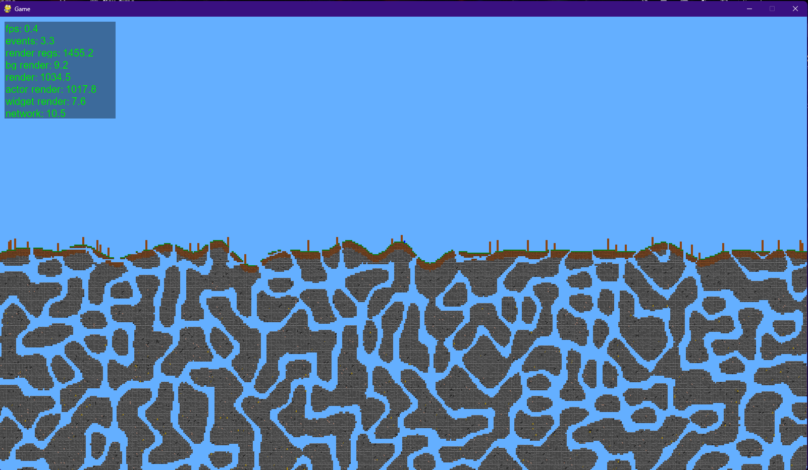

# 2D Game Engine

## Repo

[Github Repo](https://www.github.com/skelci/PythonGame)

## Dependencies

- pygame
- noise

## Latest Pics




## How to run

```bash
python ./src/main.py
```

## Credits

### Art

- [Matevž](https://github.com/BERZI-1234)

### Code

- [Matevž](https://github.com/BERZI-1234)
- [Jure](https://github.com/Gamer1234-gif)
- [Niko](https://github.com/skelci)

## TODO

### Matevž

- terrain generation

### Jure

- actor destruction

### Niko

- engine

## Items

### World Blocks

- grass block   -> dirt(4)
- dirt          -> dirt(3.5),           rock(0.25)
- log           -> wood(3.5)
- stone         -> rock(3.5)
- coal ore      -> coal(1),             rock(2.5)
- iron ore      -> raw iron nugget(3),  rock(2.5)
- gold ore      -> raw gold nugget(3),  rock(2.5)
- stone furnace -> rock(4.5)
- leaves        -> stick(0.5),          leaf(8)

### Item List

- dirt
- wood
- rock
- coal
- raw iron nugget
- iron nugget
- raw gold nugget
- gold nugget
- stick
- wood fragment
- stone furnace
- leaf
- dried leaf
- plank
- fire starter
- wooden pickaxe

### Crafting Recepies

#### Hand

- dried leaf(1),    rock(2) -> fire starter(1)
- fire starter(1)           -> rock(2), dried leaf(1)

#### Rock

- wood(1)   -> stick(1.5),  wood fragment(3.5)
- wood(1)   -> plank(1),    wood fragment(4)
- stick(2)  -> wooden pickaxe(0.5)

#### Plank

- [1 day]   leaf(1) ->  dried leaf(1)

#### Pickaxe

##### Wooden

- rock(6)   -> stone furnace(1)

#### Furnace

##### Fuel

- coal              -> 16
- wood fragment     -> 1
- stick             -> 2
- wooden pickaxe    -> 4
- dried leaf        -> 0.25

##### Stone

- [4] raw iron nugget(1) -> iron nugget(1)
- [4] raw gold nugget(1) -> gold nugget(1)

### Item Stats

#### Stone Furnace

- able to place in the world
- start fire with fire starter
- up to 2 items in the furnace
- up to 2 fuel in the furnace
- 10 seconds per fuel
- 50% efficiency

#### Fire Starter

- 10 seconds to start fire
- durability: 1
- on destruction -> rock(2)

#### Plank

- able to place in the world
- crafting efficiency: 50%
- up to 4 items dropped on it

#### Wooden Pickaxe

- can break stone, dirt, coal ore, iron ore, gold ore
- breaking time: 5 seconds
- durability: 10
- on destruction -> stick(0.5), wood fragment(2.5)
- crafting efficiency: 50%
