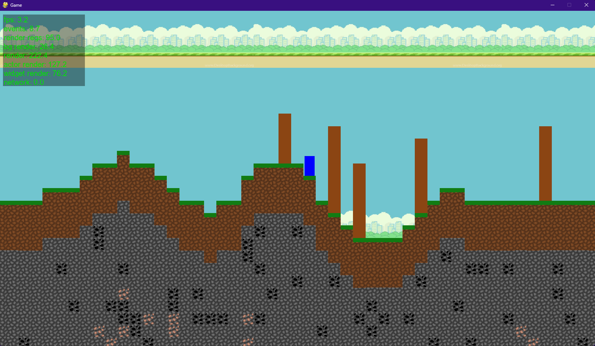

# 2D Game Engine

## Dependencies

- pygame
- noise

## Latest Pics

## Credits

### Art

- [Matevž](https://github.com/BERZI-1234)

### Code

- [Matevž](https://github.com/BERZI-1234)
- [Jure](https://github.com/Gamer1234-gif)
- [Niko](https://github.com/skelci)

## TODO

### Matevž

- terrain generation

### Jure

- actor destruction

### Niko

- engine

## crafting recepies

-tree (bark, wood, sticks) --> drop
-stone(rock) --> drop
-random cobwebs za string --> drop
-stone ingot -->drop
-clay --> drop
-leather --> drop

-rock(4*stone ingot) --> recepie

-rock on a stick(stick+string+rock) --> recepie

-axe(sticks+string+rock) --> recepie

-pickaxe(stick+string+rock) --> recepie

-sword(stick+string+rock) --> recepie

-clay brick --> recepie

-furnace (clay bricks) --> recepie

-fire starter (sticks) --> recepie

-burning torch (coal+stick) --> recepie

-infnite torch (coal+stick+netherrack) --> recepie  #nether not confirmed

-anvil (iron+iron blocks) -->recepie

-iron block (iron) --> recepie

-belt (cooked leather) --> recepie

-armor (belt+ore) --> recepie
